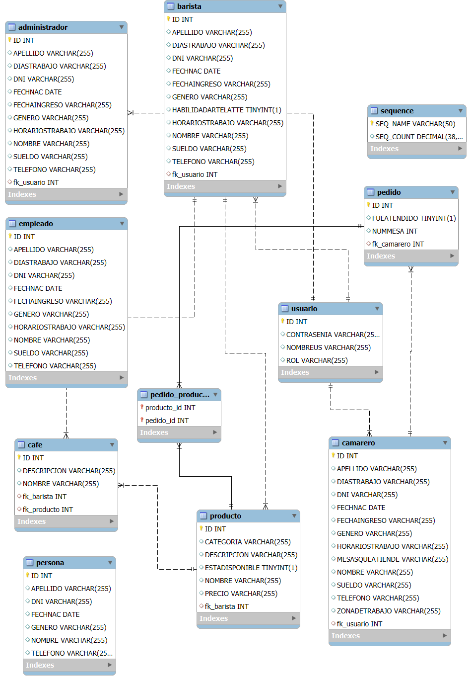

# Cafetería

Una aplicación web sencilla y básica para la exposición de los productos de una cafetería, junto con un sistema para la gestión de empleados y perfiles personalizados para cada rol.

## Flujo de la app

- **Login**: El primer usuario registrado en la app tiene el rol de ADMINISTRADOR.
- **Creación de usuarios y sus roles**: El administrador crea los usuarios y los roles necesarios.
- **Asignación de roles**: El administrador asigna los usuarios creados a los roles.
- **Usuarios**: Los nuevos usuarios inician sesión con las credenciales creadas por el admin.
- **Roles**: La app evalúa qué rol tiene cada usuario y, en base a esto, renderiza una interfaz visual diferente para cada uno.

## Tecnologías Utilizadas

- **Jakarta EE**: Servlets, Java Server Pages (JSP).
- **EclipseLink (Java Persistence API)**: Como proveedor de persistencia.
- **MySQL**: Base de datos relacional utilizada para almacenar datos.
- **Maven**: Herramienta de gestión y construcción de proyectos.

## Diagrama DER

Este diagrama representa la estructura de las entidades del proyecto en la base de datos.



## Instalación

Para ejecutar la aplicación en tu entorno local, sigue estos pasos:

1.  **Requisitos:**

    - Java Development Kit (JDK) 8 o superior.
    - Maven (para la construcción del backend).
    - MySQL instalado y en ejecución.

2.  **Configuración:**

    - Clona este repositorio.
    - Crea una base de datos MySQL y conéctala siguiendo las credenciales en el archivo de configuración de la app, que se encuentra en: `META-INF/persistence.xml` (Las tablas se crearán automáticamente).

3.  **Construcción:**

    - Construye el proyecto utilizando Maven (asegúrate de tener conexión a internet):
      ```bash
      cd Cafeteria
      mvn clean install
      ```

4.  **Ejecución y uso:**

    - Ejecuta el siguiente comando en la terminal:
      ```bash
      mvn tomcat7:run
      ```
    - Abre tu navegador web y escribe en la barra de direcciones:
      `http://localhost:8080/integrador_02`
